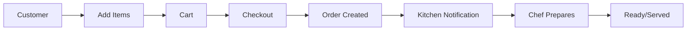

# Cart and Order System

Comprehensive documentation for cart management, checkout, and order processing in the Plattr Restaurant Management System.

## Table of Contents

- [System Overview](#system-overview)
- [Architecture](#architecture)
- [Data Structures](#data-structures)
  - [Cart Structure](#cart-structure)
  - [Order Structure](#order-structure)
- [Cart Lifecycle](#cart-lifecycle)
  - [Add to Cart Flow](#add-to-cart-flow)
  - [Variant Processing](#variant-processing)
  - [Addon Processing](#addon-processing)
  - [Price Calculation](#price-calculation)
- [Checkout and Order Flow](#checkout-and-order-flow)
  - [Checkout Process](#checkout-process)
  - [Order Creation](#order-creation)
  - [Multiple Cart Handling](#multiple-cart-handling)
- [Order States and Transitions](#order-states-and-transitions)
- [Chef Operations](#chef-operations)
- [API Reference](#api-reference)
- [Testing Guide](#testing-guide)
- [Error Handling](#error-handling)
- [Current Limitations and TODOs](#current-limitations-and-todos)

---

## System Overview

The Cart and Order system manages the full lifecycle from item selection to order completion:
- One active cart per table holding items with variants and addons
- Cart checkout creates or updates existing orders
- Server notifications via FCM on order events
- Chef-driven item status updates through preparation stages

### Firestore Collections
```
restaurants/{restaurantId}/
├── carts/{tableId}
├── orders/{orderId}
├── tables/{tableId}
└── servers/{serverId}
```

---

## Architecture



---

## Data Structures

### Cart Structure

```json
{
  "restaurantId": "rest001",
  "tableId": "table001",
  "sessionId": "sess_12345",
  "items": [
    {
      "menuItemId": "item001",
      "menuItem": {
        "meta": {
          "name": "Item Name",
          "description": "Item Description"
        }
      },
      "selectedVariantsDetails": [
        {
          "id": "variant001",
          "name": "Size",
          "selected_variant_id": "large",
          "selected_variant_name": "Large",
          "priceInfo": {
            "itemBasePrice": 10.0,
            "itemFinalPrice": 12.0
          }
        }
      ],
      "selectedAddonsDetails": [
        {
          "id": "addon001",
          "name": "Extra Cheese",
          "priceInfo": {
            "itemBasePrice": 2.0,
            "itemFinalPrice": 2.0
          }
        }
      ],
      "quantity": 1,
      "priceInfo": {
        "itemBasePrice": 10.0,
        "itemVariantBasePrice": 2.0,
        "itemAddonBasePrice": 2.0,
        "itemFinalPrice": 14.0,
        "discount": 0,
        "totalBasePrice": 14.0,
        "finalPrice": 14.0
      },
      "cartItemId": 1
    }
  ],
  "priceInfo": {
    "basePrice": 10.0,
    "finalPrice": 14.0,
    "totalDiscount": 0,
    "totalDiscountAmount": 0,
    "totalAddonBasePrice": 2.0,
    "totalVariantBasePrice": 2.0
  },
  "lastUpdated": "2024-03-24T18:00:00Z"
}
```

### Order Structure

```json
{
  "restaurantId": "rest001",
  "tableId": "table001",
  "orderNumber": "ORD-00001",
  "orderStatus": "ACTIVE",
  "paymentStatus": "UNPAID",
  "carts": [
    {
      "status": "PENDING",
      "statusHistory": [
        {
          "status": "PENDING",
          "timestamp": "2024-03-24T18:00:00Z",
          "userId": "user001"
        }
      ],
      "checkoutTime": "2024-03-24T18:00:00Z",
      "notes": "Special instructions",
      "estimatedPrepTime": 15,
      "items": [...]
    }
  ],
  "items": [...],
  "priceInfo": {
    "basePrice": 10.0,
    "finalPrice": 14.0,
    "totalDiscount": 0,
    "totalDiscountAmount": 0
  },
  "createdAt": "2024-03-24T18:00:00Z",
  "updatedAt": "2024-03-24T18:00:00Z",
  "isActive": true,
  "assignedServer": "server001",
  "sessionId": "sess_12345"
}
```

#### Dual Item Tracking

Orders maintain items at two levels:

| Level | Purpose | Usage |
|-------|---------|-------|
| `order.items` | Consolidated list | Kitchen display, order summary |
| `order.carts[].items` | Original cart items | History, cart-specific context |

---

## Cart Lifecycle

### Cart Statuses
`active` → `ordered` → `cancelled`

### Add to Cart Flow

1. **Input Validation**
   - Validate required fields (tableId, restaurantId, menuItemId, quantity)
   - If sessionId provided, validate session is active
   - Check menu item exists and is in stock

2. **Variant Processing**
   - Validate mandatory variants are selected
   - Fetch and validate variant options
   - Calculate variant pricing

3. **Addon Processing**
   - Validate selected addons exist
   - Calculate addon pricing

4. **Cart Item Management**
   - Check for identical items (based on feature flag)
   - If identical: update quantity and recalculate
   - If new configuration: add as new item with unique cartItemId

5. **Price Calculation**
   - Calculate individual item prices with variants/addons
   - Update cart total
   - Apply discounts

### Price Calculation

**Formula:** `Total = base price + variant costs + addon costs − discounts`

- `validateCart` enforces consistency
- `calculateCartValue` recalculates on mismatch
- Discounts propagate to qualifying addons (`respectParentDiscount: true`)

---

## Checkout and Order Flow

### Checkout Process (`checkoutCart`)

**Prerequisites:**
- Valid session (mandatory)
- Non-empty cart
- All items in stock

**Flow:**

1. **Validation**
   - Validate `restaurantId`, `tableId`, `sessionId`
   - Load cart; error if missing or empty
   - Ensure price validity and stock availability

2. **Order Creation/Update**
   - Check for existing active order
   - If none: generate new order number, create order
   - If exists: add new cart to existing order

3. **Cleanup**
   - Clear cart via `clearCartInternal`
   - Reset cart state

**Response:**
```json
{
  "result": {
    "message": "Checkout completed successfully.",
    "status": "success",
    "data": {
      "orderId": "...",
      "orderNumber": "ORD-XXXXX",
      "orderStatus": "active",
      "timestamp": "..."
    }
  }
}
```

### Multiple Cart Handling

When adding a new cart to an existing order:
1. Normalize cart items format
2. Add status and history tracking
3. Merge items with existing order items
4. Recalculate total order price
5. Update order timestamp

---

## Order States and Transitions

### Order Status
| Status | Description |
|--------|-------------|
| `ACTIVE` | Order in progress, table occupied |
| `COMPLETED` | Order finished and paid |
| `CANCELLED` | Order was cancelled |

### Cart Status (within Order)
| Status | Description |
|--------|-------------|
| `PENDING` | Initial state when placed |
| `ACCEPTED` | Kitchen has accepted |
| `PREPARING` | Kitchen is preparing |
| `READY` | Ready for serving |
| `SERVED` | Delivered to customer |
| `CANCELLED` | Items were cancelled |
| `RETURNED` | Items returned by customer |

### Status Flow
```
pending → preparing → ready → served → complete
```

---

## Chef Operations

### Item Status Update

Chefs update individual item status through preparation:

```json
// Request
{
  "restaurantId": "rest001",
  "orderId": "order123",
  "menuItemId": "item001",
  "cartItemId": 1,
  "newStatus": "preparing"
}

// Response
{
  "status": "success",
  "message": "Item status updated to preparing",
  "data": {
    "orderId": "order123",
    "menuItemId": "item001",
    "newStatus": "preparing",
    "updatedAt": "2024-03-24T18:30:00Z"
  }
}
```

### Cancellation Handling

When an item is cancelled:
- Item status updated at order and cart levels
- Cancelled items excluded from price calculations
- Cart and order prices recalculated

---

## API Reference

**Base URL (Local Emulator):** `http://127.0.0.1:5002/rms-app-dd875/us-central1/`

> [!TIP]
> Port may vary (5000, 5001, 5002). Check Firebase emulator output.

### 1. Clear Cart

```bash
curl -X POST 'http://127.0.0.1:5002/rms-app-dd875/us-central1/cart-clearCart' \
-H 'Content-Type: application/json' \
-d '{
    "data": {
        "restaurantId": "rest001",
        "tableId": "table001",
        "sessionId": "session001"
    }
}'
```

### 2. Add Item to Cart

```bash
curl -X POST 'http://127.0.0.1:5002/rms-app-dd875/us-central1/cart-addItemToCart' \
-H 'Content-Type: application/json' \
-d '{
    "data": {
        "restaurantId": "rest001",
        "tableId": "table001",
        "menuItemId": "item001",
        "quantity": 1,
        "selectedVariants": {
            "variant_burger_size": "burger_size_regular"
        },
        "selectedAddons": [],
        "sessionId": "session001"
    }
}'
```

### 3. Get Cart

```bash
curl -X POST 'http://127.0.0.1:5002/rms-app-dd875/us-central1/cart-getCart' \
-H 'Content-Type: application/json' \
-d '{
    "data": {
        "restaurantId": "rest001",
        "tableId": "table001",
        "sessionId": "session001"
    }
}'
```

### 4. Checkout Cart

```bash
curl -X POST 'http://127.0.0.1:5002/rms-app-dd875/us-central1/cart-checkoutCart' \
-H 'Content-Type: application/json' \
-d '{
    "data": {
        "restaurantId": "rest001",
        "tableId": "table001",
        "sessionId": "session001",
        "notes": "Extra napkins please"
    }
}'
```

### 5. Get Order

```bash
curl -X POST 'http://127.0.0.1:5002/rms-app-dd875/us-central1/order-getOrder' \
-H 'Content-Type: application/json' \
-d '{
    "data": {
        "restaurantId": "rest001",
        "orderId": "ORDER_ID_FROM_CHECKOUT"
    }
}'
```

---

## Testing Guide

### Test Identifiers
- `restaurantId`: "rest001"
- `tableId`: "table001" (primary), "table002" (alternate)
- `sessionId`: "session001", "session002"
- Menu Items: "item001" (Cheeseburger), "item002" (Coffee), "item003" (Veggie Burger)

### Test Scenarios

| Category | Test | Expected Result |
|----------|------|-----------------|
| Basic | Empty cart checkout | Error: "Cannot checkout an empty cart" |
| Basic | Post-checkout state | Cart is empty |
| Variant | Missing mandatory | Error: "Mandatory variant must be selected" |
| Variant | Multiple variants | Prices correctly calculated |
| Addon | Single/Multiple | Addon prices correctly added |
| Addon | Respect parent discount | Discount applied to qualifying addons |
| Identity | Same config add | Quantity incremented |
| Identity | Different config add | Separate entries created |

### Complete Test Flow

1. Clear cart for table001
2. Add Classic Cheeseburger with regular size
3. Add Gourmet Coffee with large size and vanilla syrup
4. Verify cart contains both items with correct pricing
5. Checkout cart
6. Verify cart is now empty
7. Retrieve order using orderId
8. Validate order contains all items

---

## Error Handling

| Error Type | Handling |
|------------|----------|
| Session validation | Reject with details |
| Cart validation | Return validation failures |
| Out-of-stock items | Block checkout |
| Price mismatch | Recalculate before proceed |
| Order creation failure | Transaction rollback |

---

## Current Limitations and TODOs

- [ ] Kitchen notifications on new orders and status updates
- [ ] Retry/backoff for FCM and transaction failures
- [ ] Granular order status states (e.g., cooking, garnishing)
- [ ] Bill generation & payment status workflow
- [ ] Multi-user session support (seat splitting)
- [ ] Automated cleanup of expired carts and sessions
- [ ] Enhanced price validation in `checkoutCart`
- [ ] Analytics & monitoring for cart/order events
- [ ] Real-time UI hooks for order updates
- [ ] Archiving and retention of completed orders

---

## Notifications

- **onOrderPlaced** (`onDocumentCreated`): Sends FCM to assigned server on new order
- **onOrderUpdated** (`onDocumentUpdated`): Sends FCM when cart status changes to `READY`
- All notifications use `sendFCMNotification` helper for uniform logging
