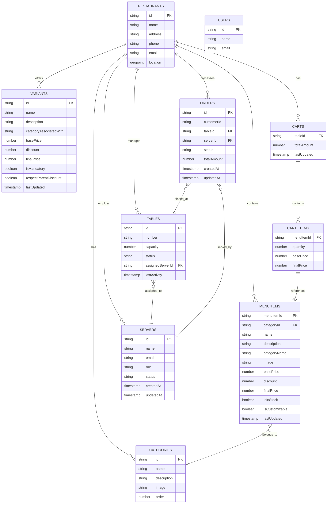

# Firestore Database Schema

Comprehensive database schema documentation for the Plattr Restaurant Management System.

## Table of Contents

- [Overview](#overview)
- [Entity Relationship Diagram](#entity-relationship-diagram)
- [Collections Structure](#collections-structure)
  - [Restaurant Info](#restaurant-info)
  - [Menu Items](#menu-items)
  - [Categories](#categories)
  - [Variants](#variants)
  - [Addons](#addons)
  - [Tables](#tables)
  - [Servers](#servers)
  - [Orders](#orders)
  - [Carts](#carts)
- [Entity Relationships](#entity-relationships)

---

## Overview

The Plattr database uses Firestore with a hierarchical document structure. All collections are nested under a `restaurants/{restaurantId}/` path, enabling multi-tenant architecture where each restaurant has isolated data.

### Base Path Structure
```
restaurants/{restaurantId}/
├── menuItems/
├── categories/
├── variants/
├── addons/
├── tables/
├── servers/
├── orders/
└── carts/
```

---

## Entity Relationship Diagram



---

## Collections Structure

### Restaurant Info

**Path:** `restaurants/{restaurantId}/info`

| Field | Type | Description |
|-------|------|-------------|
| `name` | string | Restaurant display name |
| `address` | string | Physical address |
| `phone` | string | Contact phone number |
| `email` | string | Contact email |
| `location` | geopoint | Geographic coordinates |

---

### Menu Items

**Path:** `restaurants/{restaurantId}/menuItems/{menuItemId}/`

| Field | Type | Description |
|-------|------|-------------|
| `menuItemId` | string | Unique item identifier |
| `categoryId` | string | Reference to parent category |
| `meta.name` | string | Item display name |
| `meta.description` | string | Item description |
| `meta.categoryName` | string | Category name for display |
| `meta.image` | string | Image URL |
| `priceInfo.basePrice` | number | Base price before discounts |
| `priceInfo.discount` | number | Discount amount |
| `priceInfo.finalPrice` | number | Price after discount |
| `variants` | array<object> | Available variant options |
| `addons` | array<string> | Available addon IDs |
| `nutritionalInfo` | object | Nutritional data |
| `allergenTags` | array<string> | Allergen identifiers |
| `isInStock` | boolean | Stock availability |
| `isCustomizable` | boolean | Supports customizations |
| `lastUpdated` | timestamp | Last modification time |

---

### Categories

**Path:** `restaurants/{restaurantId}/categories/{categoryId}/`

| Field | Type | Description |
|-------|------|-------------|
| `name` | string | Category name |
| `description` | string | Category description |
| `image` | string | Category image URL |
| `order` | number | Display sort order |

---

### Variants

**Path:** `restaurants/{restaurantId}/variants/{variantId}/`

| Field | Type | Description |
|-------|------|-------------|
| `meta.name` | string | Variant group name (e.g., "Size") |
| `meta.description` | string | Variant description |
| `meta.categoryAssociatedWith` | array<string> | Associated category IDs |
| `options` | array<object> | Available options |
| `options[].id` | string | Option identifier |
| `options[].name` | string | Option name (e.g., "Large") |
| `options[].priceInfo.basePrice` | number | Option base price |
| `options[].priceInfo.finalPrice` | number | Option final price |
| `options[].priceInfo.discount` | number | Option discount |
| `options[].isMandatory` | boolean | Must be selected |
| `isMandatory` | boolean | Variant group is mandatory |
| `respectParentDiscount` | boolean | Apply parent item discount |
| `relatedMenuItems` | array<string> | Associated menu item IDs |
| `lastUpdated` | timestamp | Last modification time |

---

### Addons

**Path:** `restaurants/{restaurantId}/addons/{addonId}/`

| Field | Type | Description |
|-------|------|-------------|
| `meta.name` | string | Addon name |
| `meta.description` | string | Addon description |
| `meta.categoryAssociatedWith` | array<string> | Associated categories |
| `priceInfo.basePrice` | number | Addon base price |
| `priceInfo.discount` | number | Discount amount |
| `priceInfo.finalPrice` | number | Final price |
| `isMandatory` | boolean | Required addon |
| `respectParentDiscount` | boolean | Inherit parent discount |
| `itemsAssociatedWith` | array<string> | Associated menu items |
| `isInStock` | boolean | Availability |

---

### Tables

**Path:** `restaurants/{restaurantId}/tables/{tableId}/`

| Field | Type | Description |
|-------|------|-------------|
| `number` | string | Table number/name |
| `capacity` | number | Seating capacity |
| `status` | string | `vacant` or `occupied` |
| `currentOTP.code` | string | Active OTP code |
| `currentOTP.createdAt` | timestamp | OTP creation time |
| `currentOTP.expiresAt` | timestamp | OTP expiration time |
| `occupiedBy` | array<string> | Phone numbers of occupants |
| `primaryCustomer.phoneNumber` | string | Primary customer phone |
| `primaryCustomer.name` | string | Primary customer name |
| `assignedServerId` | string | Assigned server ID |
| `lastActivity` | timestamp | Last activity timestamp |

---

### Servers

**Path:** `restaurants/{restaurantId}/servers/{serverId}/`

| Field | Type | Description |
|-------|------|-------------|
| `name` | string | Server name |
| `email` | string | Server email |
| `role` | string | Role (waiter, chef, manager) |
| `status` | string | Work status |
| `createdAt` | timestamp | Account creation date |
| `updatedAt` | timestamp | Last update date |
| `assignedTables` | array<string> | Assigned table IDs |

---

### Orders

**Path:** `restaurants/{restaurantId}/orders/{orderId}/`

| Field | Type | Description |
|-------|------|-------------|
| `customerId` | string | Customer identifier |
| `tableId` | string | Associated table |
| `serverId` | string | Assigned server |
| `status` | string | Order status |
| `items` | array<object> | Ordered items |
| `totalAmount` | number | Order total |
| `createdAt` | timestamp | Order creation time |
| `updatedAt` | timestamp | Last update time |

---

### Carts

**Path:** `restaurants/{restaurantId}/carts/{tableId}/`

| Field | Type | Description |
|-------|------|-------------|
| `totalAmount` | number | Cart total value |
| `lastUpdated` | timestamp | Last cart update |

#### Cart Items Sub-collection

**Path:** `restaurants/{restaurantId}/carts/{tableId}/items/{itemId}/`

| Field | Type | Description |
|-------|------|-------------|
| `menuItemId` | string | Reference to menu item |
| `quantity` | number | Item quantity |
| `priceInfo.basePrice` | number | Base price |
| `priceInfo.finalPrice` | number | Final calculated price |
| `priceInfo.discount` | number | Applied discount |
| `selectedVariants` | object | Selected variant options |
| `selectedAddons` | array<string> | Selected addon IDs |

---

## Entity Relationships

| Relationship | Description |
|--------------|-------------|
| Restaurant → Menu Items | One-to-many: Restaurant contains multiple menu items |
| Restaurant → Categories | One-to-many: Restaurant has multiple categories |
| Restaurant → Tables | One-to-many: Restaurant manages multiple tables |
| Restaurant → Servers | One-to-many: Restaurant employs multiple servers |
| Menu Item → Category | Many-to-one: Items belong to one category |
| Table → Server | Many-to-one: Tables assigned to servers |
| Order → Table | Many-to-one: Orders placed at tables |
| Order → Server | Many-to-one: Orders served by servers |
| Cart → Table | One-to-one: One cart per table |
| Cart → Cart Items | One-to-many: Cart contains items |
| Cart Item → Menu Item | Many-to-one: Items reference menu items |
