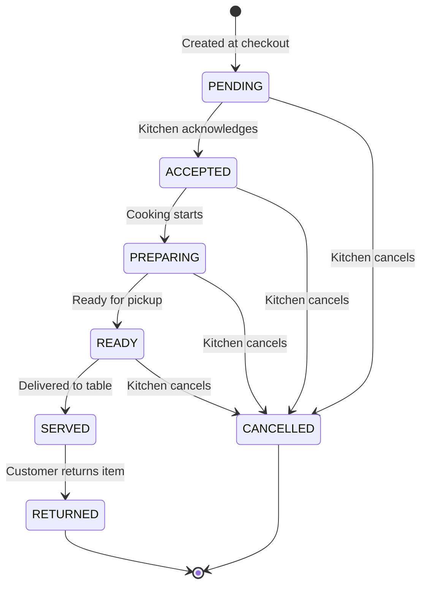

# Cart Operations - Complete Flow Documentation

> **Deep-dive documentation** covering all cart operations, data structures, edge cases, and entity relationships.

---

## Table of Contents
- [Core Entities & Relationships](#core-entities--relationships)
- [Cart Data Structure](#cart-data-structure)
- [Cart Operations](#cart-operations)
  - [addItemToCart](#1-additemtocart)
  - [removeItemFromCart](#2-removeitemfromcart)
  - [getCart](#3-getcart)
  - [clearCart](#4-clearcart)
  - [checkoutCart](#5-checkoutcart)
  - [updateCartStatus](#6-updatecartstatus)
- [Price Calculation System](#price-calculation-system)
- [Cart Status Lifecycle](#cart-status-lifecycle)
- [Firestore Triggers](#firestore-triggers)
- [Feature Flags](#feature-flags)

---

## Core Entities & Relationships

```
┌─────────────┐      ┌──────────────┐      ┌─────────────┐
│  CUSTOMER   │──────│   SESSION    │──────│    TABLE    │
└─────────────┘      └──────────────┘      └─────────────┘
                            │
                            ▼
┌─────────────┐      ┌──────────────┐      ┌─────────────┐
│   CART      │◄─────│   CHECKOUT   │─────►│   ORDER     │
└─────────────┘      └──────────────┘      └─────────────┘
      │                                           │
      ▼                                           ▼
┌─────────────┐                            ┌─────────────┐
│ CART ITEMS  │                            │   CARTS[]   │
│ (in cart)   │                            │ (in order)  │
└─────────────┘                            └─────────────┘
```

### Key Relationships
- **Cart** is scoped to `restaurantId + tableId` (path: `restaurants/{restaurantId}/carts/{tableId}`)
- **Session** links customer to table and is required for checkout
- **Order** contains snapshots of carts (plural) - each checkout creates a new cart entry in the order
- **IMP** A single order can have multiple carts (from multiple checkouts in same session)

---

## Cart Data Structure

### Cart Document Structure
```javascript
{
  restaurantId: string,       // Reference to restaurant
  tableId: string,            // Reference to table
  sessionId: string,          // Active session ID
  items: CartItem[],          // Array of cart items
  priceInfo: CartTotalPriceInfo,  // Aggregated price totals
  lastUpdated: Timestamp      // Last modification time
}
```

### Cart Item Structure
```javascript
{
  menuItemId: string,         // Reference to menu item
  menuItem: object,           // Snapshot of menu item data
  quantity: number,           // Item quantity (>= 1)
  cartItemId: number,         // Unique ID within cart (auto-incremented)
  status: CART_ITEM_STATUS,   // Item status (PENDING initially)
  
  // Customization Details
  selectedVariantsDetails: [{
    id: string,                    // Variant ID
    name: string,                  // Variant name (e.g., "Size")
    isMandatory: boolean,          // If required to select
    respectParentDiscount: boolean, // Inherit parent item discount
    selected_variant_id: string,   // Selected option ID
    selected_variant_name: string, // Selected option name (e.g., "Large")
    priceInfo: BasicPriceInfo      // Price of this variant
  }],
  
  selectedAddonsDetails: [{
    id: string,                    // Addon ID
    name: string,                  // Addon name
    respectParentDiscount: boolean, // Inherit parent item discount
    priceInfo: BasicPriceInfo      // Price of this addon
  }],
  
  // Price Information (per item × quantity)
  priceInfo: CartItemPriceInfo
}
```

### Price Info Models

**BasicPriceInfo** (for menu items, variants, addons):
```javascript
{ basePrice, finalPrice, discount }
```

**CartItemPriceInfo** (for cart items):
```javascript
{
  itemBasePrice,           // Single item base price
  itemFinalPrice,          // Single item after discount
  totalVariantBasePrice,   // All variant prices
  totalVariantFinalPrice,  // Variants after discount
  totalAddonBasePrice,     // All addon prices
  totalAddonFinalPrice,    // Addons after discount
  totalBasePrice,          // (item + variants + addons) × quantity
  finalPrice,              // Final price × quantity
  discount,                // Discount percentage
  discountAmount           // Absolute discount amount
}
```

**CartTotalPriceInfo** (for entire cart):
```javascript
{
  basePrice,               // Sum of all items' basePrice
  finalPrice,              // Sum of all items' finalPrice
  totalVariantBasePrice,   // Sum of all variant prices
  totalAddonBasePrice,     // Sum of all addon prices
  totalDiscount,           // Average discount percentage
  totalDiscountAmount      // Total amount saved
}
```

---

## Cart Operations

### 1. addItemToCart

**Path**: `cart-addItemToCart`  
**Purpose**: Add menu item to cart with variants/addons

#### Input
```javascript
{
  tableId: string,           // Required
  restaurantId: string,      // Required
  menuItemId: string,        // Required
  quantity: number,          // Required, >= 1
  selectedVariants: {        // Optional, map of variantId -> optionId
    "size": "large",
    "spice": "medium"
  },
  selectedAddons: string[],  // Optional, array of addon IDs
  sessionId: string          // Optional but recommended
}
```

#### Flow
1. **Validate inputs** via `validateAddItemFields()`
2. **Validate session** if sessionId provided (active status check)
3. **IMP** Check feature flag `fallbackToSameCustomConfigurationForAddItem`:
   - If enabled and same menuItemId exists in cart, inherit its variant/addon config
   - This enables "quick add" without re-selecting customizations
4. **Firestore transaction** (prevents race conditions):
   - Fetch cart and menuItem in parallel
   - Create default cart if not exists
   - **Validate menuItem is in stock** (fails with 412 if out of stock)
   - **Process variants**:
     - Fetch variant docs from Firestore
     - Validate mandatory variants are selected
     - Validate selected option exists within each variant
   - **Process addons**:
     - Fetch addon docs from Firestore
     - Validate all addon IDs exist
   - **Calculate item price** via `calculateItemPrice()`
   - **Detect duplicates** via `findIdenticalItemInCart()`:
     - Same menuItemId + same variants (by ID) + same addons (by ID)
     - If identical exists: increment quantity
     - If different config exists: 
       - **IMP** Check `isMultipleVariantOrAddonForMenuItemsSupported` flag
       - If disabled: return error with existing item details
       - If enabled: add as new item
   - Calculate cart total via `calculateCartValue()`
   - **Sanitize cart** to prevent NaN values
   - Save cart with `lastUpdated` timestamp

#### Output
```javascript
{
  message: "Item added to cart successfully.",
  status: "success",
  data: { cart: CartDocument }
}
```

#### Edge Cases
- **IMP** Mandatory variant not selected → 400 error
- **IMP** Item out of stock → 412 error
- **IMP** Invalid quantity (< 1, NaN) → 400 error
- Same item with different variant/addon config → behavior depends on feature flag
- Session expired → 412 error (if sessionId provided)
- Cart with corrupted quantity values → auto-fixed to 0

---

### 2. removeItemFromCart

**Path**: `cart-removeItemFromCart`  
**Purpose**: Decrement item quantity or remove from cart

#### Input
```javascript
{
  tableId: string,           // Required
  restaurantId: string,      // Required
  menuItemId: string,        // Required (fallback identifier)
  cartItemId: number         // Optional (preferred identifier)
}
```

#### Flow
1. **Validate inputs** via `validateRemoveItemFields()`
2. Fetch cart from Firestore
3. **Locate target item**:
   - First try matching by `cartItemId` (unique within cart)
   - Fallback to matching by `menuItemId` (first match)
4. **Decrement or remove**:
   - If quantity > 1: decrement by 1, recalculate item price
   - If quantity = 1: remove item from array
5. **Recalculate cart totals**:
   - If items remain: update cart
   - If no items: **delete entire cart document**
6. Return updated cart

#### Output
```javascript
{
  message: "Item removed from cart successfully.",
  status: "success",
  data: { cart: CartDocument }
}
```

#### Edge Cases
- **IMP** cartItemId takes precedence over menuItemId for item matching
- Empty cart after removal → cart document deleted
- Invalid quantity stored → treated as 1

---

### 3. getCart

**Path**: `cart-fetchCart`  
**Purpose**: Retrieve cart contents for a table

#### Input
```javascript
{
  restaurantId: string,      // Required
  tableId: string,           // Required
  sessionId: string          // Optional
}
```

#### Flow
1. **Validate inputs** via `validateGetCartFields()`
2. **Validate session** if provided
3. Fetch cart from Firestore
4. **If cart exists**:
   - Fix missing arrays (`selectedVariantsDetails`, `selectedAddonsDetails`)
   - Fix invalid quantity values (set to 1)
   - **Sanitize all price values** using price models
   - **IMP** Recalculate cart totals via `calculateCartValue()` and update in Firestore
5. **If cart doesn't exist**:
   - Return empty cart structure (not null)

#### Output
```javascript
{
  message: "Cart retrieved successfully.",
  status: "success",
  data: { cart: CartDocument }
}
```

#### Edge Cases
- **IMP** Cart auto-heals on retrieval (fixes NaN, missing fields)
- Non-existent cart returns empty structure, not error
- Price recalculation happens on every fetch

---

### 4. clearCart

**Path**: `cart-clearCart`  
**Purpose**: Delete entire cart for a table

#### Input
```javascript
{
  tableId: string,           // Required
  restaurantId: string       // Required
}
```

#### Flow
1. **Validate inputs** via `validateCheckoutFields()`
2. Fetch cart document
3. **Delete cart document** from Firestore
4. Return success message

#### Internal Function: `clearCartInternal()`
- Used by `checkoutCart` after order creation
- Same logic but throws Error instead of HttpsError
- **IMP** If cart delete fails after order creation, order is still considered successful (logged as warning)

---

### 5. checkoutCart

**Path**: `cart-checkoutCart`  
**Purpose**: Convert cart to order and clear cart

#### Input
```javascript
{
  restaurantId: string,      // Required
  tableId: string,           // Required
  sessionId: string,         // Required (mandatory!)
  notes: string              // Optional
}
```

#### Flow
1. **Validate inputs** via `validateCheckoutFields()`
2. **IMP** **Validate session is active** via `validateCheckoutSession()`:
   - If no sessionId → returns 401 with OTP requirements
   - If session invalid/inactive → returns 401 with OTP requirements
3. Fetch cart from Firestore (direct read, not via getCart)
4. **Validate cart exists and has items**:
   - No cart → 412 error
   - Empty cart → 412 error
5. **Validate cart price consistency** via `validateCart()`:
   - If prices are inconsistent → recalculate via `calculateCartValue()`
   - If recalculation fails → 412 error
6. **Validate stock availability**:
   - Fetch all menu items in cart
   - **IMP** Items that became out of stock since cart creation → 412 error with item names
7. **Create or update order** via `createOrUpdateOrder()`:
   - Checks for existing active order for same table+session
   - If exists: adds cart as new cart snapshot to order's `carts[]` array
   - If not: creates new order with this cart
   - Order number generated via counter: `ORD-00001` format
   - **IMP** Items stored at BOTH order level (`items[]`) and cart level (`carts[].items[]`)
8. **Clear cart** via `clearCartInternal()`:
   - **IMP** If clear fails but order created → logged as warning, considered success
9. Return order details

#### Output
```javascript
{
  message: "Checkout completed successfully.",
  status: "success",
  data: {
    orderId: string,
    orderNumber: string,     // e.g., "ORD-00001"
    orderStatus: string,     // "IN_PROGRESS"
    timestamp: ISO string
  }
}
```

#### Edge Cases
- **IMP** No sessionId → 401 with auth requirements (not 400)
- **IMP** Stock validation at checkout time (items can go out of stock after adding to cart)
- **IMP** Same order can have multiple cart checkouts (multi-round ordering)
- Cart already checked out → graceful handling (cart deleted)

---

### 6. updateCartStatus

**Path**: `cart-updateCartStatus`  
**Purpose**: Update status of a cart within an order (kitchen workflow)

#### Input
```javascript
{
  restaurantId: string,      // Required
  orderId: string,           // Required
  cartIndex: number,         // Required (0-based index in order.carts[])
  newStatus: CART_STATUS,    // Required
  notes: string,             // Optional
  sessionId: string          // Optional
}
```

#### Flow
1. **Validate inputs** via `OrderInputValidation.validateUpdateCartStatusFields()`
2. **Validate session** if provided
3. **Firestore transaction**:
   - Fetch order document
   - Validate cart exists at given index
   - **Validate status transition** via `isValidStatusTransition()`
   - Create status history entry
   - Update cart status
   - If status = ACCEPTED: set `assignedTo` to userId
   - Check if all carts served (for order completion logic)
   - Update order document

#### Valid Status Transitions
```
PENDING    → ACCEPTED, CANCELLED
ACCEPTED   → PREPARING, CANCELLED
PREPARING  → READY, CANCELLED
READY      → SERVED, CANCELLED
SERVED     → RETURNED
RETURNED   → (terminal)
CANCELLED  → (terminal)
```

#### Output
```javascript
{
  success: true,
  message: "Cart status updated to ACCEPTED",
  data: OrderDocument
}
```

#### Edge Cases
- **IMP** Invalid transition → error (e.g., PENDING → READY not allowed)
- **IMP** Cart index out of bounds → error
- When all carts reach SERVED/CANCELLED/RETURNED → order can be marked COMPLETED

---

## Price Calculation System

### `calculateItemPrice(menuItem, selectedVariants, selectedAddons)`

**Purpose**: Calculate single item price with customizations

#### Logic
1. Get item base price and discount from menuItem
2. **Process variants**:
   - Sum variant base prices
   - If `respectParentDiscount = true`: apply item discount to variant
   - Else: use variant's own final price
3. **Process addons**:
   - Same logic as variants for discount inheritance
4. **Calculate totals**:
   ```
   totalBase = itemBase + variantBase + addonBase
   totalFinal = itemFinal + variantFinal + addonFinal
   discountAmount = totalBase - totalFinal
   ```
5. Round all values to 2 decimal places

### `calculateCartValue(cart)`

**Purpose**: Aggregate all item prices into cart totals

#### Logic
1. Loop through all items:
   - Skip cancelled items
   - Accumulate base, final, variant, addon prices
2. Calculate total discount amount and percentage
3. Return CartTotalPriceInfo

#### IMP Edge Cases
- Cancelled items excluded from totals
- Invalid quantity → treated as 1
- Missing priceInfo → skipped with warning

---

## Cart Status Lifecycle

### Cart Item Status (in cart before checkout)
```
Items are created with status: PENDING
(No further status changes in cart - status changes happen in order.carts[])
```

### Cart Status (within order after checkout)


---

## Firestore Triggers

### `onOrderPlaced` (order document created)

**Purpose**: Notify assigned server of new order

#### Trigger Path
`restaurants/{restaurantId}/orders/{orderId}`

#### Flow
1. Check feature flag `sendServerNotifications`
2. Get tableId from order
3. Lookup table → get serverId
4. Lookup server → get FCM token
5. Send push notification: "New Order Placed - Table {tableId}"

---

### `onOrderUpdated` (order document updated)

**Purpose**: Notify server when items are ready

#### Flow
1. Check feature flag `sendServerNotifications`
2. Compare before/after carts array
3. Find carts that transitioned TO `READY` status
4. If any found:
   - Lookup table → serverId
   - Lookup server → FCM token
   - Send notification: "Order Ready - Table {tableId}"

---

## Feature Flags

| Flag Name | Purpose |
|-----------|---------|
| `fallbackToSameCustomConfigurationForAddItem` | If enabled, reuse existing variant/addon config when adding same item |
| `isMultipleVariantOrAddonForMenuItemsSupported` | If disabled, prevent same item with different customizations |
| `isUsernameEnabled` | Username mandatory in auth |
| `isMultiUserSupportEnabled` | Allow multiple customers per table |
| `sendServerNotifications` | Enable FCM notifications to servers |

---

## Summary: Key Nuances & Edge Cases

### Data Integrity
- **IMP** All price values sanitized to prevent NaN (replaced with 0)
- **IMP** Cart recalculated on every `getCart` call for consistency
- **IMP** Transactions used for `addItemToCart` and `updateCartStatus`

### Session Handling
- **IMP** Session validation optional for cart operations, MANDATORY for checkout
- **IMP** Expired/invalid session at checkout returns auth requirements (not just error)

### Stock Management
- **IMP** Stock checked at add time AND checkout time
- **IMP** Items can go out of stock between add and checkout

### Order Integration
- **IMP** One order can have multiple carts (multi-round ordering)
- **IMP** Items duplicated at order level AND cart level for different use cases
- **IMP** Cart clearing failure after order creation doesn't fail the checkout

### Status Transitions
- **IMP** Strict state machine for cart status within orders
- **IMP** Only valid transitions allowed
- **IMP** All active carts served → order can be completed
