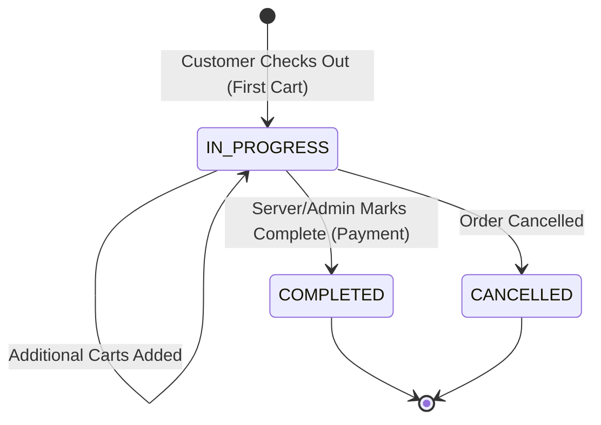
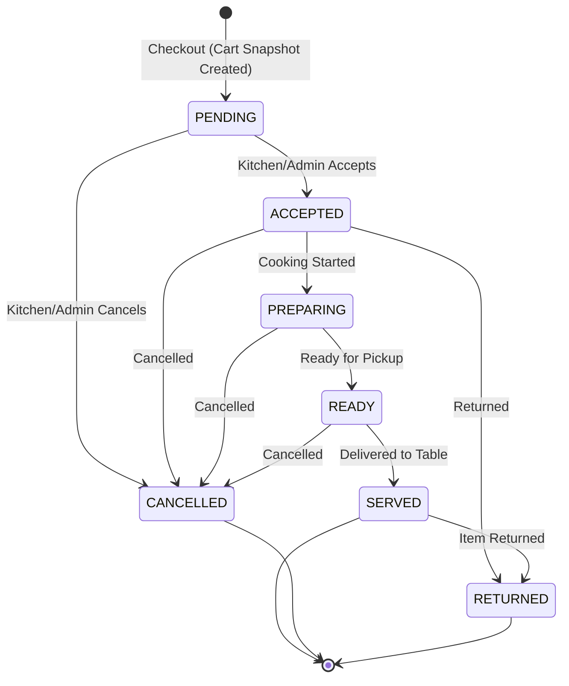

# Order Flow & Lifecycle Specification

## 1. Overview
The **Order System** manages the lifecycle of customer orders from cart checkout to completion. It supports a **multi-cart model** where a single "Order" container aggregates multiple "Carts" (checkouts) from the same table session. This allows multiple users at a table to add items independently or sequentially while maintaining a single active bill.

**Key Entities:**
- **Order**: Represents the table's active bill. Contains a list of carts.
- **Cart**: A snapshot of items checked out at a specific time.
- **Cart Item**: Individual menu items within a cart.

---

## 2. State Machines

### 2.1 Order Status Lifecycle
The `ORDER_STATUS` tracks the overall progress of the table's experience.



- **IMP**: `PENDING` status exists in constants but `createOrUpdateOrder` initializes directly to `IN_PROGRESS`.
- **IMP**: `COMPLETED` implies payment is settled (`paymentStatus` set to `PAID`).

### 2.2 Cart Status Lifecycle
Each cart within an order has its own independent status (`CART_STATUS/CART_ITEM_STATUS`).



- **IMP**: Valid transitions are strictly enforced by `VALID_TRANSITIONS` map in `updateCartStatus`.
- **IMP**: `SERVED` is the terminal success state for a cart.

---

## 3. Order Creation Flow (`createOrUpdateOrder`)

Triggered internally by `checkoutCart`.

**Process:**
1. **Input Validation**: Validates `restaurantId`, `tableId`, and `cart` structure.
2. **Snapshot Creation**: 
   - A unique `cartId` is generated: `${restaurantId}_${tableId}_${uuid_fragment}`.
   - Status set to `CART_STATUS.PENDING`.
   - `checkoutTime` timestamp recorded.
   - `estimatedPrepTime` calculated (Base 10m + 2m/item).
3. **Item Normalization**: 
   - Flattens cart items for the order (stripping complex menu data, keeping essential pricing/variant info).
   - Skips cancelled items.
4. **Transaction**:
   - **Check for Active Order**: Queries `orders` collection for `tableId` where status is `IN_PROGRESS` or `PENDING`.
   - **Scenario A: New Order** (No active order found)
     - Generates new `orderNumber` (Counter-based).
     - Creates new Order document.
     - `orderStatus`: `IN_PROGRESS`.
     - `paymentStatus`: `UNPAID`.
     - `carts`: Array containing the new cart snapshot.
     - `priceInfo`: Calculated from this cart.
   - **Scenario B: Update Order** (Active order exists)
     - Appends new cart to `carts` array.
     - Merges new items into `items` array (for easier indexing).
     - **Price Aggregation**: Recalculates `priceInfo` by summing up ALL carts in the order.
     - Concatenates notes.
     - Updates `updatedAt`.

---

## 4. Multi-Cart & Price Aggregation Logic

The system supports "continuous ordering".
- **Structure**: `Order.carts` is an array of cart objects.
- **Price Calculation**: `calculateTotalPriceInfo(carts)`
  - Iterates through ALL carts in the `carts` array.
  - Sums `basePrice`, `finalPrice`, `totalDiscountAmount`.
  - Averages `totalDiscount`.
  - **IMP**: This ensures the main Order document always reflects the total bill value of all checkouts.

---

## 5. Order Retrieval Patterns (`getOrder`)

Flexible retrieval based on context:

1.  **By Order ID**:
    - Direct lookup by `orderId`.
    - Returns sanitized order object.
2.  **By Table ID**:
    - **Active Only (Default)**:
      - Returns the *single most recent* active order (`IN_PROGRESS`, `PENDING`, etc.).
      - Used by the consumer app to show the current session's status.
    - **All Orders (`getAllOrders=true`)**:
      - Returns list of all orders for the table.
      - Can still filter by `activeOnly` to get all active orders (though usually only 1 exists per table).

**Sanitization**:
- Converts Firestore `Timestamp` objects to ISO strings.
- Flattens some nested structures for frontend consumption.

---

## 6. Server & Admin Operations

### 6.1 `updateOrderStatus`
- **Purpose**: Advance the main order lifecycle (e.g., Pay & Close).
- **Completion Logic (`COMPLETED`)**:
    - **Re-validation**: Recalculates total price from all carts one last time to ensure data integrity.
    - **Payment**: Sets `paymentStatus` to `PAID`.
    - **Notification**: Finds the table's `assignedServerId` and sends an FCM notification ("Order Completed").

### 6.2 `updateCartStatus`
- **Purpose**: Manage kitchen workflow (Accept -> Prepare -> Serve).
- **Granularity**: Updates status of a specific **Cart** within the Order (identified by `cartIndex`).
- **Validation**: Checks `VALID_TRANSITIONS` (e.g., cannot go `PENDING` -> `SERVED` directly).
- **History**: Appends to `statusHistory` array with timestamp and user.
- **Auto-Complete Logic**:
    - Checks if **ALL** active carts in the order are now `SERVED`, `CANCELLED`, or `RETURNED`.
    - *Current Implementation*: Logs a message. Future hook available to auto-complete the Order.

### 6.3 `getActiveOrdersForRestaurant`
- **Purpose**: Dashboard view for Kitchen/Staff.
- **Filtering**: Excludes `COMPLETED` orders.
- **Sorting**:
    - **Primary**: By `assignedServer` (if `serverId` filter provided).
    - **Secondary**: By `updatedAt` (most recent first).
- **Item Sorting**: Inside each cart, items are sorted to show `READY` items first (prioritizing food ready to serve).

---

## 7. Validation & Constraints

- **Order Number**:
    - Format: `ORD-00001`
    - Generated transactionally using a `counters/orders` document per restaurant.
- **Concurrency**:
    - All status updates and order creations use Firestore **Transactions** to prevent race conditions (e.g., double order creation for same table).
- **Session Security**:
    - `validateSessionId`: Optional but recommended. Ensures the request comes from a valid, active session.

## 8. Data Model Summary (Order)

```json
{
  "restaurantId": "string",
  "tableId": "string",
  "orderNumber": "ORD-12345",
  "orderStatus": "IN_PROGRESS",
  "paymentStatus": "UNPAID",
  "carts": [
    {
      "cartId": "...",
      "items": [...],
      "status": "ACCEPTED",
      "priceInfo": {...},
      "checkoutTime": Timestamp
    },
    // ... more carts
  ],
  "items": [...], // Flattened list of all items for easy querying
  "priceInfo": {
    "basePrice": 100,
    "finalPrice": 90
    // ... aggregated totals
  },
  "sessionId": "...",
  "assignedServer": "userId",
  "createdAt": Timestamp,
  "updatedAt": Timestamp
}
```
