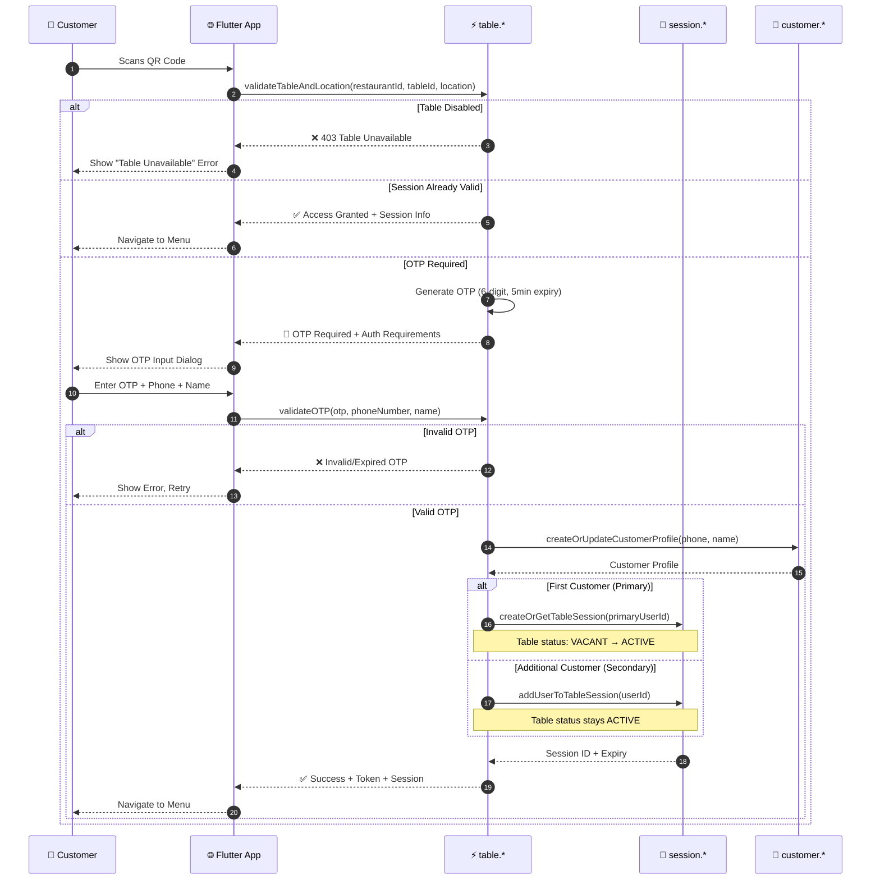
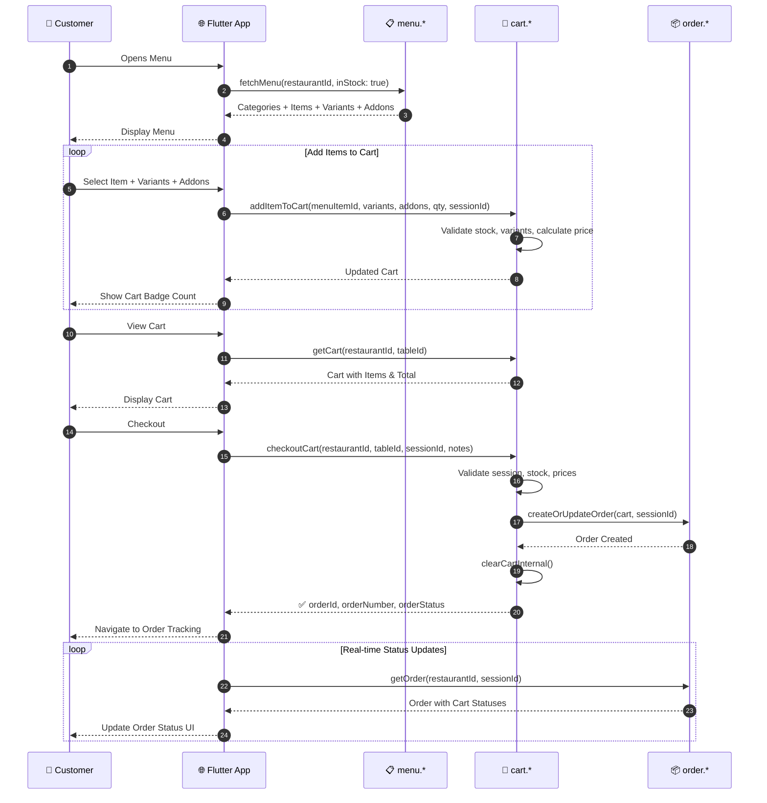
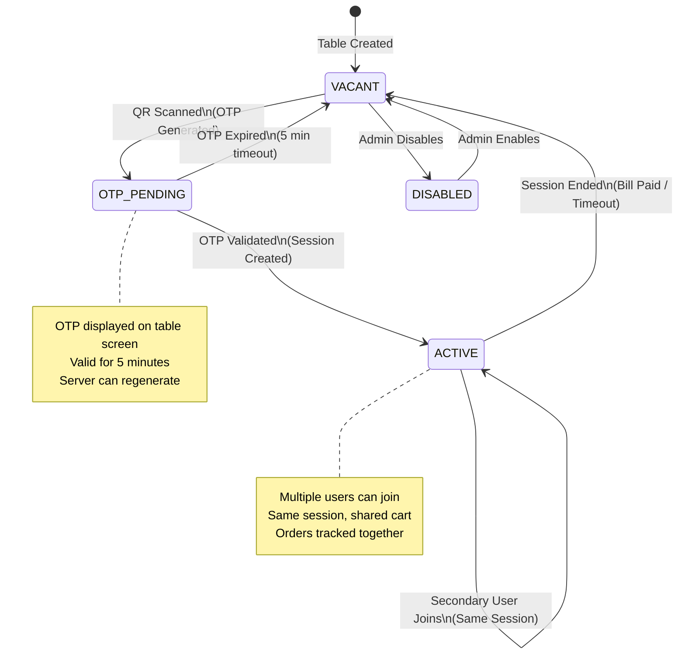
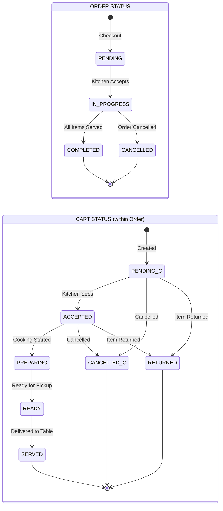

# Plattr Pro Consumer App - Complete Flow Analysis & API Documentation

## Overview

The Plattr Pro consumer app is a **Flutter web application** for restaurant customers to:
1. **Scan QR codes** at restaurant tables
2. **Authenticate** via OTP verification  
3. **Browse menus** with variants/addons
4. **Manage cart** and place orders
5. **Track order status** in real-time

The app follows a **session-based table model** where customers join a table session to collaborate on orders.

---

## 🗺️ Complete User Journey


---

## 🔐 Authentication Flow (Detailed)



---

## 🍔 Ordering Flow (Menu → Cart → Checkout)



---

## 🔄 Table State Machine



---

## 📦 Order & Cart Status Lifecycle



---

## 💰 Price Calculation Flow

```mermaid
flowchart LR
    subgraph ITEM["Menu Item"]
        BASE["Base Price: ₹100"]
        DISC["Discount: 10%"]
    end
    
    subgraph VARIANT["Selected Variant"]
        VBASE["+ Variant Price: ₹20"]
        VDISC{{"respectParentDiscount?"}}
    end
    
    subgraph ADDON["Selected Addons"]
        ABASE["+ Addon Price: ₹30"]
        ADISC{{"respectParentDiscount?"}}
    end
    
    subgraph CALC["Calculation"]
        FINAL["Final Price"]
    end
    
    BASE --> DISC
    DISC -->|"Item: ₹90"| VBASE
    VBASE --> VDISC
    VDISC -->|"Yes: ₹18"| ABASE
    VDISC -->|"No: ₹20"| ABASE
    ABASE --> ADISC
    ADISC -->|"Yes: ₹27"| FINAL
    ADISC -->|"No: ₹30"| FINAL
    
    FINAL -->|"₹90 + ₹18 + ₹27 = ₹135"| TOTAL["Total per Item"]
    TOTAL -->|"× Quantity"| CART["Cart Total"]
```



---

## 🎯 Quick Reference: API Endpoints

| Stage | Function | Key Parameters |
|-------|----------|----------------|
| **Entry** | `validateTableAndLocation` | restaurantId, tableId, location, sessionId? |
| **Auth** | `validateOTP` | restaurantId, tableId, otp, phoneNumber, name |
| **Menu** | `fetchMenu` | restaurantId, inStock |
| **Cart** | `addItemToCart` | menuItemId, variants, addons, quantity, sessionId |
| **Cart** | `getCart` | restaurantId, tableId |
| **Checkout** | `checkoutCart` | restaurantId, tableId, sessionId, notes |
| **Orders** | `getOrder` | restaurantId, tableId, orderId, sessionId |

---

## Key API Endpoints & Nuances

### 1. Table Validation & Authentication APIs

#### `table-validateTableAndLocation`
**Purpose**: Initial table access validation and session checking  
**Endpoint**: `/table-validateTableAndLocation`  
**Method**: POST (Firebase callable function)

**Request Structure**:
```json
{
  "data": {
    "restaurantId": "string (required)",
    "tableId": "string (required)", 
    "userLocation": {
      "latitude": "number (required)",
      "longitude": "number (required)"
    },
    "sessionId": "string (optional - if user has existing session)"
  }
}
```

**Important Nuances**:
- **Session Persistence**: If `sessionId` provided and valid, returns immediate access
- **Feature Flags Control**: `isOtpManadatoryAtScan` determines if OTP required at scan time
- **Location Validation**: Validates user is physically at restaurant location
- **Multi-user Support**: `isMultiUserSupportEnabled` affects authentication requirements
- **Table Status Handling**: Different responses for vacant vs active tables

**Response Scenarios**:
1. **Success with Session**: Grants immediate access, returns table/session info
2. **OTP Required**: Returns auth requirements and primary customer info
3. **Location Mismatch**: HTTP 412 - user not at restaurant
4. **Table Disabled**: HTTP 403 - table unavailable

#### `table-validateOTP`
**Purpose**: OTP validation and session creation  
**Endpoint**: `/table-validateOTP`  
**Method**: POST (Firebase callable function)

**Request Structure**:
```json
{
  "data": {
    "restaurantId": "string (required)",
    "tableId": "string (required)",
    "otp": "string (required - 6 digit code)",
    "phoneNumber": "string (conditional)",
    "name": "string (conditional)"
  }
}
```

**Critical Nuances**:
- **Conditional Fields**: 
  - `phoneNumber` required for primary customers or when multi-user disabled
  - `name` required when `isUsernameEnabled` or for primary customers
- **Primary vs Secondary**: Vacant/OTP_PENDING tables create primary customer
- **Session Management**: Creates new session for primary, joins existing for secondary
- **Customer Profile**: Automatically creates/updates customer in Firestore
- **Firebase Auth**: Returns custom token for Firebase authentication
- **OTP Expiry**: OTP expires after 5 minutes

**Table Status Flow**:
- **Vacant/OTP_PENDING** → **Active** (Primary customer)
- **Active** → **Active** (Secondary customer joins)

### 2. Menu Management APIs

#### `menu-fetchMenu-fetchMenu`
**Purpose**: Retrieve restaurant menu with categories and items  
**Endpoint**: `/menu-fetchMenu-fetchMenu`  
**Method**: POST (Firebase callable function)

**Request Structure**:
```json
{
  "data": {
    "restaurantId": "string (required)",
    "inStock": "boolean (optional, default: true)"
  }
}
```

**Important Nuances**:
- **Stock Filtering**: `inStock` filters out unavailable items
- **Hierarchical Structure**: Returns categories → menu items → variants → addons
- **Price Calculations**: Includes base price, discounts, final price
- **Variant Requirements**: Mandatory vs optional variants
- **Addon Dependencies**: Addons associated with specific items
- **Respect Parent Discount**: Addons can inherit item-level discounts

**Response Structure**:
```json
{
  "result": {
    "categories": [...],
    "menuItems": {
      "categoryId": [...items]
    }
  }
}
```

### 3. Cart Management APIs

#### `cart-addItemToCart`
**Purpose**: Add/update items in customer's cart  
**Endpoint**: `/cart-addItemToCart`  
**Method**: POST (Firebase callable function)

**Request Structure**:
```json
{
  "data": {
    "tableId": "string (required)",
    "restaurantId": "string (required)",
    "menuItemId": "string (required)",
    "quantity": "number (required, > 0)",
    "selectedVariants": {
      "variantId": "optionId"
    },
    "selectedAddons": ["addonId1", "addonId2"],
    "sessionId": "string (optional but recommended)"
  }
}
```

**Critical Nuances**:
- **Mandatory Variant Validation**: Must select required variants before adding
- **Identical Item Detection**: Same item+variant+addon config increases quantity
- **Price Calculation Chain**: Base → Variants → Addons → Discounts → Final
- **Cart Item ID**: Auto-generated unique identifier for each cart configuration
- **Stock Validation**: Checks item availability before adding
- **Session Validation**: Validates session if provided

#### `cart-fetchCart`
**Purpose**: Retrieve current cart contents  
**Endpoint**: `/cart-fetchCart`  
**Method**: POST (Firebase callable function)

**Request Structure**:
```json
{
  "data": {
    "tableId": "string (required)",
    "restaurantId": "string (required)"
  }
}
```

**Important Nuances**:
- **Cart Repair**: Frontend automatically repairs cart items with missing data
- **Price Consistency**: Validates price calculations against menu
- **Menu Item Lookup**: Enriches cart items with current menu data
- **Empty Cart Handling**: Returns empty structure, not null

### 4. Order Management APIs

#### `cart-checkoutCart`
**Purpose**: Convert cart to order and clear cart  
**Endpoint**: `/cart-checkoutCart`  
**Method**: POST (Firebase callable function)

**Request Structure**:
```json
{
  "data": {
    "restaurantId": "string (required)",
    "tableId": "string (required)",
    "sessionId": "string (required - mandatory for checkout)",
    "notes": "string (optional)"
  }
}
```

**Critical Nuances**:
- **Session Mandatory**: Must have valid session for checkout
- **Cart Validation**: Validates cart exists and has items
- **Stock Re-validation**: Checks item availability at checkout time
- **Price Validation**: Ensures cart prices are consistent
- **Order Creation/Update**: Creates new order or adds to existing active order
- **Dual Item Tracking**: Items stored at both order and cart levels
- **Cart Clearing**: Automatically clears cart after successful order
- **Transaction Safety**: Order creation and cart clearing are separate operations

#### `order-getOrder`
**Purpose**: Retrieve order details and history  
**Endpoint**: `/order-getOrder`  
**Method**: POST (Firebase callable function)

**Request Structure**:
```json
{
  "data": {
    "restaurantId": "string (required)",
    "tableId": "string (optional - for table orders)",
    "orderId": "string (optional - for specific order)",
    "getAllOrders": "boolean (optional, default: false)",
    "activeOnly": "boolean (optional, default: true)",
    "sessionId": "string (optional)"
  }
}
```

**Important Nuances**:
- **Flexible Retrieval**: Can get specific order, table orders, or all orders
- **Session Validation**: Validates session if provided
- **Status Filtering**: `activeOnly` filters by order status
- **Order Sanitization**: Cleans timestamps and data structure for frontend
- **Cart Status Tracking**: Each cart within order has status history
- **Real-time Updates**: Order status changes are reflected immediately

## Database Schema Overview

### Core Collections Structure
```
restaurants/
├── {restaurantId}/
    ├── info (restaurant details)
    ├── tables/
    │   └── {tableId} (table status, OTP, session, occupiedBy, primaryCustomer)
    ├── sessions/
    │   └── {sessionId} (session data, expiry, users)
    ├── menuItems/
    │   └── {itemId} (item details, variants, addons, pricing)
    ├── categories/
    │   └── {categoryId} (category info)
    ├── variants/
    │   └── {variantId} (variant options and pricing)
    ├── addons/
    │   └── {addonId} (addon details and pricing)
    ├── carts/
    │   └── {tableId} (cart items, pricing, session)
    └── orders/
        └── {orderId} (order details, carts, items, status)

customers/
└── {phoneNumber} (customer profile, visits, preferences)

servers/
└── {serverId} (server details, assigned tables, FCM token)
```

## Important Business Logic Patterns

### 1. Session Management
- **Validity**: 5 hours or until table cleared
- **Multi-device**: Multiple devices can join same table
- **Authentication**: Firebase custom tokens for authenticated users
- **Persistence**: Stored in browser local storage

### 2. Table State Machine
```
VACANT → OTP_PENDING → ACTIVE → VACANT
  ↑         ↓           ↓         ↑
  └─────────┴───────────┴─────────┘
```

### 3. Price Calculation Hierarchy
```
Base Price
    ↓
+ Variant Prices
    ↓  
+ Addon Prices
    ↓
- Item Discounts (applied to variants/addons if respectParentDiscount: true)
    ↓
= Final Price
```

### 4. Error Handling Patterns
- **Graceful Degradation**: App continues working with limited functionality
- **Retry Logic**: Automatic retries for network failures
- **User Feedback**: Clear error messages with action guidance
- **State Recovery**: Session restoration and cart repair

### 5. Feature Flags Impact
- `isOtpManadatoryAtScan`: Controls authentication at QR scan
- `isUsernameEnabled`: Makes name mandatory for users
- `isMultiUserSupportEnabled`: Allows multiple users per table
- `isMultipleVariantOrAddonForMenuItemsSupported`: Cart item consolidation

## Security & Performance Considerations

### Security
- **Location Validation**: Ensures physical presence at restaurant
- **Session Tokens**: Secure session management with expiry
- **OTP Expiry**: 5-minute OTP validity window
- **Input Validation**: Comprehensive server-side validation
- **Firebase Rules**: (Currently open for development - needs tightening)

### Performance
- **Offline Capability**: Cart persistence across network issues
- **Real-time Updates**: Firebase listeners for order status
- **State Management**: Provider pattern for efficient updates  
- **Data Caching**: Session and menu data cached locally
- **Lazy Loading**: Menu items loaded as needed

This comprehensive analysis covers the complete consumer app flow with all critical APIs, business logic nuances, and architectural patterns that future developers need to understand for effective development and maintenance.